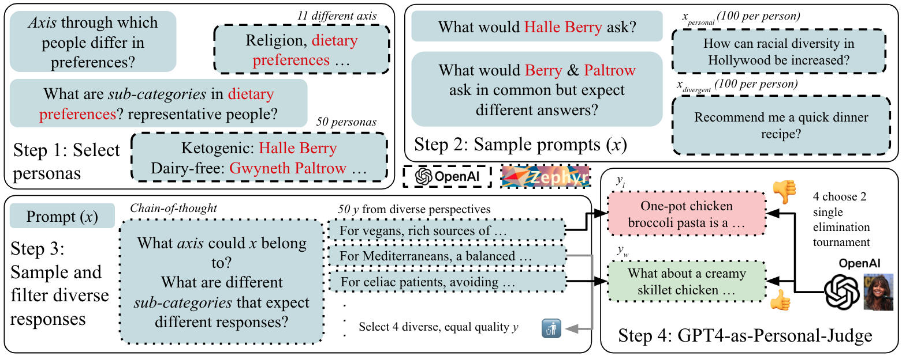

# FamousPersona: Is Active Persona Inference Necessary for Aligning Small Models to Personal Preferences?

<p align="left">
  <a href="https://huggingface.co/datasets/zilu-peter-tang/famous-persona">
    
  </a>
  <a href="https://arxiv.org/abs/2505.13257">
    
  </a>
  <a href="https://github.com/PootieT/famous-persona/blob/main/LICENSE">
    
  </a>
</p>

<p align="center">
  
</p>

## TL;DR
Our paper (EMNLP PALS workshop 2025) investigate whether active personalization (i.e. inferring user preferences explicitly) has advantages over passive personalization
(i.e. learning explicitly over interaction history). We found active personalization to have better potential for 
**generalization** (given good inference model), more **contextually faithful**, and less systematically 
**biased** across protected attributes.

## Dataset: Famous-Persona
We built FamousPersona, a personalized alignment dataset built from 50 famous people with fine-grained personal 
preferences publicly known. Each person has 200 preference pairs in total, 50:50 train and split. Half of questions are
personal questions (i.e. something only that person would ask). Half of the questions are divergent questions, where the 
person is expected to share a conflicting preference with at least another person in the dataset. See figure above for 
our dataset generation procedure (and refer to the paper). You can access our dataset on [huggingface]()

## Project Setup (to reproduce our results)
1. Clone our repository with `git clone`. Then pull raw dataset file with `git lfs pull`.
2. Follow `alignment-handbook` installation [instruction](alignment-handbook-mirror/README.md)
3. Follow `reward-bench` installation [instruction](reward-bench/README.md)
4. Clone [alphaca-farm](https://github.com/tatsu-lab/alpaca_farm.git), put `sampling/annotator_config` inside 
`alpaca_farm/auto_annotations/annotators` and refer to the target .yaml file. Please refer to alpacafarm code for details.
5. Install the following libraries:
```commandline
pip install bm25 sentence-transformers toposort tiktoken alpaca_eval pyyaml
```

## Our Codebase setup
To reproduce our dataset, you can looking to the following directories:
- `sampling`: Everything related to dataset generation
- `data`: Dataset files
- `alignment-handbook-mirror`: Everything related to training. Modified from [alignment-handbook](https://github.com/huggingface/alignment-handbook).
- `reward-bench`: Everything related to evaluation. Modified from [reward-bench](https://github.com/allenai/reward-bench)
- `experiments`: Everything related to scripts that run our training/evaluation experiments.
- `dump`: Raw results from our experiments
- `analysis` : Code related to processing the results, attributions, etc.

## Citation

If you find our work helpful, please cite our work using the following citation!

```bibtex
@article{tang2025is,
  title={Is Active Persona Inference Necessary for Aligning Small Models to Personal Preferences?},
  author={Tang, Zilu and Aky{\"u}rek, Afra Feyza and Aky{\"u}rek, Ekin and Wijaya, Derry},
  journal={arXiv preprint arXiv:2505.13257},
  year={2025}
}
```
Feel free to reach out for questions (email in preprint).


